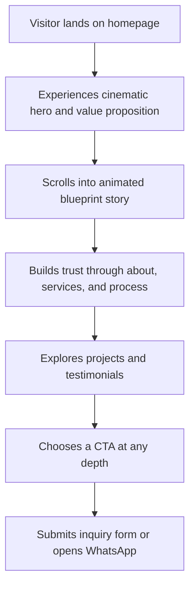

## 1. Product Overview
PEC Dubai is a premium engineering consultancy and architecture website designed to convert high-value Dubai clients through cinematic storytelling, editorial luxury aesthetics, and highly practical trust signals.
- The core story is "From Concept to Masterpiece", taking a visitor from a line on paper to a completed architectural outcome through motion, proof, and conversion-focused UX.
- The product targets luxury villa owners, developers, investors, and commercial clients in Dubai who need architecture, structural, MEP, approvals, and supervision under one consultancy brand.

## 2. Core Features

### 2.1 Feature Module
1. **Home page**: cinematic hero, animated blueprint story, about section, services, featured projects, process timeline, why PEC, testimonials and trust bar, contact CTA.
2. **Projects page**: full portfolio grid, project filters, featured hero project, project cards with hover detail reveals.
3. **Services page**: service overview, detailed discipline sections, permit and authority support positioning, CTA blocks.
4. **About page**: company narrative, certifications, regional coverage, team credibility, methodology.
5. **Contact page**: inquiry form, WhatsApp CTA, office details, response promise, trust bullets.

### 2.2 Page Details
| Page Name | Module Name | Feature description |
|-----------|-------------|---------------------|
| Home | Hero | Fullscreen cinematic hero with premium typography overlay, architectural grid atmosphere, live counters, primary and secondary CTA hierarchy |
| Home | Blueprint Story | Animated SVG floor plan with self-drawing strokes on scroll, staged narrative: Vision, Planning, Engineering, Execution, Masterpiece |
| Home | About PEC | Authority-building copy, visual architectural placeholder, luxury offset frame, badges for ISO, 7 Emirates, DDA pre-qualified, LEED |
| Home | Services | Six-discipline service grid with custom line-art visuals, gold hover wash, reveal arrows, supporting CTA moments |
| Home | Featured Projects | Editorial masonry layout with one dominant project card and four supporting cards, hover overlays and detail reveals |
| Home | Process Timeline | Five-phase horizontal timeline with animated line fill and sequential phase activation |
| Home | Why PEC | Numbered differentiator list plus certification and qualification badge grid |
| Home | Testimonials + Trust Bar | Three editorial testimonial cards, decorative quotation anchors, trust counters and key proof metrics |
| Home | Contact / CTA | Detailed inquiry form, WhatsApp conversion card, office details, trust bullets, response time promise |
| Projects | Portfolio Listing | Masonry or structured grid of completed and featured work with category labeling and hover detail |
| Services | Service Details | Expanded explanations for architecture, structural, MEP, supervision, approvals, and sustainability support |
| About | Company Story | Market positioning, credentials, integrated service promise, regional capability |
| Contact | Inquiry Hub | Full conversion page with lead form, WhatsApp, office information, practical decision-making support |

## 3. Core Process
The homepage funnel is built around four conversion stages. First, attention is captured with a cinematic hero and luxury visual atmosphere. Second, curiosity deepens through the animated blueprint section that demonstrates technical credibility visually rather than verbally. Third, desire is built with projects, services, process clarity, and client proof. Fourth, action is made easy through repeated CTA placement, WhatsApp access, and a friction-light consultation form.

## 4. User Interface Design
### 4.1 Design Style
- Primary colors: Obsidian `#080A0C`, Gold `#B8976A`, Gold Light `#D4B896`, Fog `#8A9099`, White `#F2F0EC`
- Border treatment: glass border `rgba(184,151,106,0.18)` for premium framed cards
- Button style: rounded premium buttons, gold primary fill, ghost secondary action, subtle glow and hover lift
- Typography: Cormorant Garamond 300/400 for display, Inter 300/400 for body, Space Mono for labels, counters, coordinates, and architectural annotation
- Layout style: editorial luxury with asymmetrical grids, dark monograph-inspired panels, strong negative space, and cinematic sectional pacing
- Icon style suggestions: custom architectural line art, technical drafting motifs, minimal certification badges

### 4.2 Page Design Overview
| Page Name | Module Name | UI Elements |
|-----------|-------------|-------------|
| Home | Hero | Dark obsidian panel, floating architectural grid, particle atmosphere, premium headline, compact stat bar, visible CTAs above fold |
| Home | Blueprint Story | Self-drawing SVG plan, gold and blueprint-blue line accents, stage labels, progress sequencing, scroll-triggered reveal |
| Home | About PEC | Offset gold frame, architectural elevation placeholder, badge row, short authority-rich copy blocks |
| Home | Services | 3-column desktop / 2-column mobile grid, subtle gold hover illumination, custom discipline line art |
| Home | Projects | Editorial masonry grid, dominant hero project, hover panel rise, scale transitions, descriptive captions |
| Home | Process | Horizontal line, animated phase dots, phase labels in Space Mono, scroll-triggered fill animation |
| Home | Why PEC | Split layout with numbered proof points and badge wall |
| Home | Testimonials | Three-card editorial block, oversized quote marks, counter trust bar beneath |
| Home | Contact | Form-heavy practical layout, green WhatsApp glass panel, office info, service bullets, response promise |

### 4.3 Responsiveness
- Desktop-first composition with strong visual hierarchy and layered layouts
- Mobile adaptation using `clamp()`-based type sizing and compact spacing
- CTA buttons must remain visible without scrolling in the hero
- Sticky WhatsApp button remains visible on mobile
- Form fields use mobile-friendly input types and autocomplete attributes
- Three.js hero scene only loads when device capacity supports it; fallback remains elegant on weaker devices

### 4.4 3D Scene Guidance
- Environment and mood: dark blueprint chamber inspired by Dubai night architecture, subtle gold atmosphere, technical precision
- Lighting setup: low-key ambient fill, controlled gold accent light, cool blueprint rim light
- Camera settings and motion: smooth slow drift only, never aggressive; slight parallax and soft orbital movement
- Composition: architectural plan or massing centered behind headline with readable overlay contrast
- Interactions: hero scene runs subtly on load; blueprint section uses SVG self-draw on scroll as the main storytelling interaction
- Post-processing: minimal to none unless lightweight; focus on clean rendering and contrast instead of flashy bloom
- Performance budgets: keep hero geometry simple, minimize draw calls, prefer SVG and CSS motion for most sections, support reduced-motion and low-power fallback

## 5. Conversion Strategy
- Primary funnel: Hero attention -> Blueprint proof moment -> Services and projects desire -> Contact action
- CTA placement: hero, about, services cards, navigation, contact section, sticky mobile WhatsApp
- Primary CTA language: consultation-oriented, low-anxiety, no hard-sell wording
- Micro-commitment framing: free consultation, response promise, low-friction WhatsApp path

## 6. Content and Tone Guidelines
- Tone: authoritative, aspirational, accessible
- Style: specific proof over vague claims
- Structure: emotional at the top, rational near contact
- Language choices: avoid empty superlatives such as "leading" or "world-class"; prefer certification, permit speed, disciplines covered, and measurable project facts

## 7. SEO and Growth Requirements
- Target keyword clusters: engineering consultancy Dubai, architecture firm Dubai, MEP engineering UAE, structural engineer Dubai, luxury villa design Dubai, LEED consultant UAE
- Metadata: benefit-led titles and descriptions for each route
- Structured data: Organization, LocalBusiness, ProfessionalService, and Service schema
- Local SEO: Dubai-specific service and project language, office detail emphasis, future location landing page extensibility

## 8. Delivery Phases
1. **Phase 1 — Foundation**: initialize Next.js project structure, design token system, fonts, shared layout, navigation, footer, mobile menu, design system
2. **Phase 2 — Core Sections**: implement hero, blueprint SVG story component, about, services, projects, process, trust, testimonials, contact
3. **Phase 3 — Polish**: integrate GSAP ScrollTrigger, counters, loader, page transitions, cursor behavior, WhatsApp polish, form UX refinement
4. **Phase 4 — Performance & SEO**: optimize images and code splitting, add schema, metadata, sitemap, validate Core Web Vitals, mobile QA patterns
