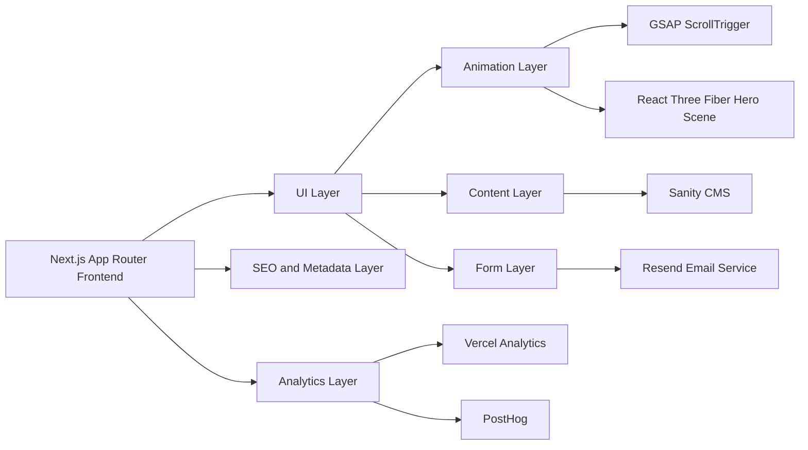
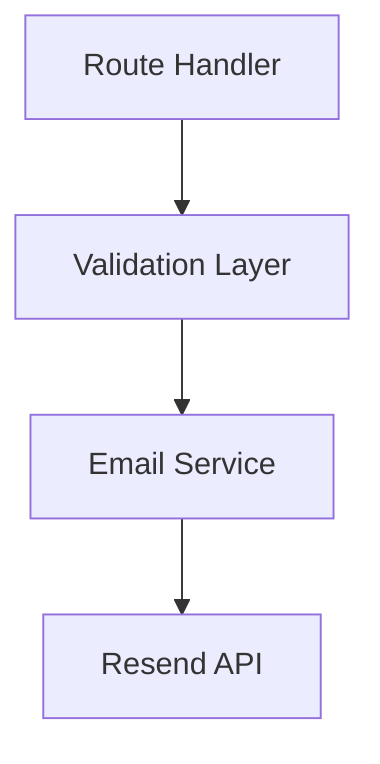
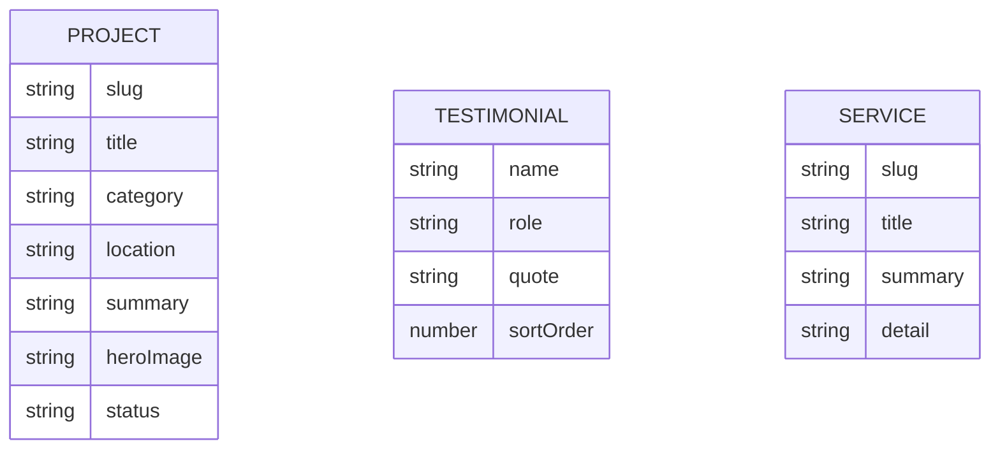

## 1. Architecture Design



## 2. Technology Description

* Framework: Next.js 16 App Router with TypeScript

* Styling: Tailwind CSS 4 + CSS custom properties for tokens

* Animation: GSAP 3 + ScrollTrigger

* 3D: React Three Fiber + Drei for hero only

* Forms: React Hook Form for validation and state management

* Email delivery: Resend via server route

* CMS: Sanity.io for projects and testimonials

* Analytics: Vercel Analytics + PostHog

* Images: Next/Image with future Cloudinary integration for optimized delivery

* Deployment: Vercel

## 3. Route Definitions

| Route     | Purpose                                                         |
| --------- | --------------------------------------------------------------- |
| /         | Homepage with cinematic storytelling and core conversion funnel |
| /projects | Full portfolio listing and featured project storytelling        |
| /services | Service overview and discipline detail content                  |
| /about    | Company profile, credibility, methodology, qualifications       |
| /contact  | Dedicated inquiry and office contact page                       |

## 4. API Definitions

### 4.1 Inquiry Submission

```ts
export type InquiryRequest = {
  name: string;
  phone: string;
  email: string;
  service: string;
  projectType: string;
  budget: string;
  brief: string;
};

export type InquiryResponse = {
  success: boolean;
  message: string;
};
```

| Method | Route        | Purpose                                                 |
| ------ | ------------ | ------------------------------------------------------- |
| POST   | /api/inquiry | Validate inquiry form data and send an email via Resend |

### 4.2 CMS Content Fetching

| Method | Route             | Purpose                                                                      |
| ------ | ----------------- | ---------------------------------------------------------------------------- |
| GET    | /api/projects     | Optional cached facade for project listing if needed beyond direct CMS fetch |
| GET    | /api/testimonials | Optional cached facade for testimonials if needed beyond direct CMS fetch    |

## 5. Server Architecture Diagram



## 6. Data Model

### 6.1 Content Model Definition



### 6.2 Data Definition Language

* Sanity content types:

  * `project`: title, slug, category, location, summary, gallery, metrics, completionStatus

  * `testimonial`: name, role, quote, sortOrder

  * `service`: title, slug, summary, detail, lineArtKey

* Inquiry submissions do not require database persistence in phase 1; they are emailed through Resend

## 7. Frontend Structure

| Directory               | Purpose                                               |
| ----------------------- | ----------------------------------------------------- |
| src/app                 | App Router pages, layouts, metadata, route handlers   |
| src/components/layout   | Header, footer, navigation, containers                |
| src/components/sections | Homepage and page section modules                     |
| src/components/ui       | Buttons, headings, badges, counters, field components |
| src/components/three    | Lightweight hero-only 3D scene and helpers            |
| src/lib                 | Utility functions, analytics helpers, schema helpers  |
| src/data                | Temporary local content during non-CMS phases         |

## 8. Animation Architecture

| Area              | Implementation                                                                          |
| ----------------- | --------------------------------------------------------------------------------------- |
| Hero              | React Three Fiber scene with subtle camera motion, particle grid, and blueprint massing |
| Blueprint section | GSAP ScrollTrigger + SVG stroke-dashoffset sequencing                                   |
| Section reveals   | GSAP fade-up, translate, and stagger orchestration                                      |
| Process timeline  | GSAP sequential line fill and dot activation                                            |
| Counters          | Lightweight requestAnimationFrame count-up or GSAP numeric animation                    |
| Loader            | GSAP intro timeline                                                                     |
| Custom cursor     | requestAnimationFrame loop on desktop only                                              |

## 9. Performance Strategy

* Load Three.js hero scene dynamically only on capable devices

* Provide reduced-motion and low-power fallback for the hero

* Keep hero geometry simple and avoid post-processing-heavy effects

* Use SVG and CSS for most premium motion effects outside the hero

* Defer non-critical analytics until after main content becomes interactive

* Use optimized Next fonts with `display: swap`

* Keep the hero section height controlled so CTA buttons remain visible without scrolling

## 10. SEO and Structured Data Plan

* Metadata per route using Next.js Metadata API

* JSON-LD on homepage for Organization and ProfessionalService

* JSON-LD on services pages for Service schema

* Sitemap generation using Next.js route-based generation

* Open Graph images and concise benefit-led descriptions for social and search

## 11. Implementation Phases

### Phase 1 — Foundation

* Initialize Next.js project files

* Configure Tailwind, tokens, font system, base layout, navigation, footer, sticky CTA

* Build shared UI primitives and homepage content structure

### Phase 2 — Core Experience

* Build homepage hero with lightweight R3F scene

* Implement blueprint story SVG section

* Implement about, services, projects, process, why PEC, testimonials, trust bar, contact

* Create route shells for projects, services, about, and contact

### Phase 3 — Polish and Conversion

* Integrate GSAP ScrollTrigger across sections

* Add counters, trust bar motion, masonry hover choreography, optional custom cursor and loader

* Build React Hook Form + Resend integration

* Refine WhatsApp CTA and sticky mobile conversion behavior

### Phase 4 — Performance and SEO

* Optimize Core Web Vitals and Lighthouse

* Add JSON-LD, metadata, sitemap, and route-level SEO

* Prepare Sanity content model integration and deploy-ready content pipeline

